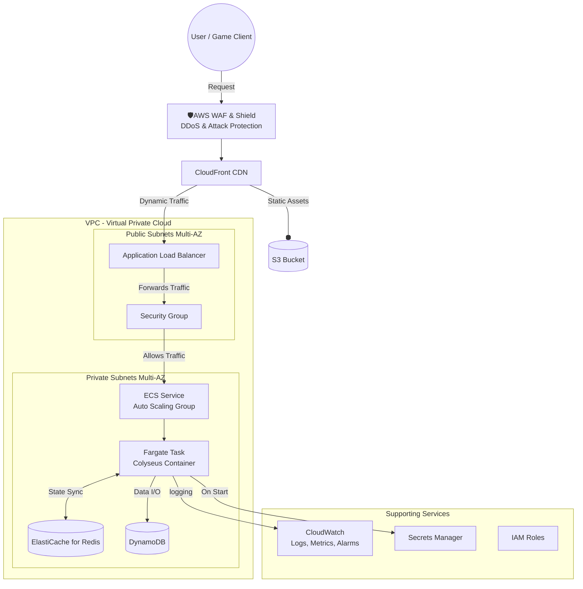

[日本語](#japanese) | [English](#english)

# 🎮 Colyseus on AWS: 本番環境レベルの IaC / CI/CD ポートフォリオ

## 1. プロジェクト概要 

このプロジェクトは、リアルタイム多人数参加型ゲームサーバーである **[Colyseus](https://www.colyseus.io/)** を、  
**AWS クラウド上で本番環境レベルの品質で稼働** させることを目的とした個人ポートフォリオです。

**Infrastructure as Code (Terraform)** と **CI/CD (GitHub Actions)** のプラクティスを全面的に採用し、  
高可用性、スケーラビリティ、セキュリティ、そしてコスト効率に優れた、  
**再現可能かつ自動化されたクラウドネイティブなシステム** を構築するプロセスを実証します。

---

## 2. 目標アーキテクチャ 

以下は本プロジェクトが最終的に目指すシステムの全体構成図です。  
ユーザーリクエストの入口からデータストレージまで、多層防御と Multi-AZ による高可用性を考慮した設計です。

## 3. 技術スタック 

| カテゴリ | 技術 | 目的 |
|----------|------|------|
| クラウド | **AWS (Amazon Web Services)** | 主要なクラウドプラットフォーム |
| コンテナ | **Docker**, **Amazon ECR** | アプリケーションのパッケージ化とレジストリ |
| オーケストレーション | **Amazon ECS on AWS Fargate** | サーバーレスなコンテナ実行環境 |
| IaC | **Terraform** | インフラのコードによる宣言的な管理 |
| CI/CD | **GitHub Actions** | ビルド、テスト、デプロイの自動化 |
| ネットワーク | **VPC**, **ALB**, **CloudFront**, **WAF** | 高可用なトラフィック管理とセキュリティ |
| データストア | **ElastiCache (Redis)**, **DynamoDB** | 状態同期と永続的データストレージ |
| 監視 | **Amazon CloudWatch** | ログ、メトリクス、アラーム |
| セキュリティ | **IAM**, **Secrets Manager** | 権限管理と機密情報管理 |
| アプリケーション | **Colyseus (Node.js, TypeScript)** | リアルタイム通信サーバー |

---

## 4. プロジェクトロードマップ  

本プロジェクトは、以下の 4 つのフェーズで段階的に構築を進めています。

###  フェーズ1：ローカルでの実行と手動デプロイ
- [x] Colyseusアプリケーションのコンテナ化 (Docker)  
- [x] Dockerイメージのビルドと ECR へのプッシュ  
- [x] AWS コンソール上での手動デプロイ検証  

**目的:**  
アプリケーションの動作確認と、クラウド上でコンテナを動かすための基本的な要素を理解する。

---

###  フェーズ2：Terraform によるインフラのコード化 (IaC)
- [ ] VPC、サブネット、ルートテーブル等のネットワーク基盤のコード化  
- [ ] ECS クラスター、タスク定義、サービスのコード化  
- [ ] `terraform apply` によるインフラの自動構築  

**目的:**  
手動操作を排除し、再現可能で一貫性のあるインフラをコードで管理する。

---

###  フェーズ3：データ層とネットワーク層の統合
- [ ] ElastiCache (Redis) と DynamoDB の追加  
- [ ] Application Load Balancer (ALB) の導入  
- [ ] セキュリティグループによる精密なアクセスコントロール  

**目的:**  
状態管理と永続化データ層を統合し、安全な公開エンドポイントを持つ本格的なバックエンドを構築する。

---

###  フェーズ4：CI/CD パイプラインの構築と最終化
- [ ] GitHub Actions ワークフローの作成  
- [ ] OIDC による AWS 認証のセキュアな設定  
- [ ] `git push` をトリガーとした、ビルドからデプロイまでの完全自動化  

**目的:**  
開発から本番リリースまでのプロセスを自動化し、迅速なイテレーションを可能にする。

---

## 5. 現在の進捗 

**フェーズ1は完了済み**です。

- Colyseus アプリケーションを **Docker コンテナ** として正常にパッケージ化済み。  
- ビルドされたイメージは **プライベートな Amazon ECR リポジトリ** に安全に保管済み。  
- これにより、実行環境の標準化が完了し、クラウド上のどこでも同じように動作させる準備が整いました。

**現在の作業:** フェーズ2（Terraform によるインフラのコード化）に着手中。  
- 優先タスク例: ネットワーク（VPC / サブネット）と ECS クラスタの Terraform モジュール化、状態管理（remote state）の設計、Terraform のベストプラクティス導入。

**次のステップ（短期）:**  
1. Terraform モジュールの初期セット（VPC、サブネット、セキュリティグループ）を作成する。  
2. ECS / Fargate 用のタスク定義とサービスを Terraform で定義し、ECR との連携を検証する。  
3. CloudWatch ログや Secrets Manager の基本連携を組み込む。

---

# 🎮 Colyseus on AWS: Production-Grade IaC / CI/CD Portfolio

## 1. Project Overview

This is a personal portfolio project aimed at running the real-time multiplayer game server **[Colyseus](https://www.colyseus.io/)** on the **AWS cloud with production-level quality**.

By fully adopting **Infrastructure as Code (Terraform)** and **CI/CD (GitHub Actions)** practices, this project demonstrates the process of building a **reproducible and automated cloud-native system** that is highly available, scalable, secure, and cost-effective.

---

## 2. Target Architecture

The following is the overall architecture diagram that this project aims to achieve.
It is designed with multi-layered defense and high availability through Multi-AZ, from user requests to data storage.

## 3. Technology Stack

| Category | Technology | Purpose |
|----------|------|------|
| Cloud | **AWS (Amazon Web Services)** | Main cloud platform |
| Container | **Docker**, **Amazon ECR** | Application packaging and registry |
| Orchestration | **Amazon ECS on AWS Fargate** | Serverless container execution environment |
| IaC | **Terraform** | Declarative management of infrastructure as code |
| CI/CD | **GitHub Actions** | Automation of build, test, and deploy |
| Network | **VPC**, **ALB**, **CloudFront**, **WAF** | Highly available traffic management and security |
| Datastore | **ElastiCache (Redis)**, **DynamoDB** | State synchronization and persistent data storage |
| Monitoring | **Amazon CloudWatch** | Logs, metrics, and alarms |
| Security | **IAM**, **Secrets Manager** | Permissions and secrets management |
| Application | **Colyseus (Node.js, TypeScript)** | Real-time communication server |

---

## 4. Project Roadmap

This project is being built in the following four phases.

### Phase 1: Local Execution and Manual Deployment
- [x] Containerize the Colyseus application (Docker)
- [x] Build Docker image and push to ECR
- [x] Manual deployment verification on the AWS console

**Objective:**
To confirm the application's operation and understand the basic elements for running containers in the cloud.

---

### Phase 2: Infrastructure as Code with Terraform (IaC)
- [ ] Code the network infrastructure such as VPC, subnets, and route tables
- [ ] Code the ECS cluster, task definitions, and services
- [ ] Automate infrastructure creation with `terraform apply`

**Objective:**
To eliminate manual operations and manage a reproducible and consistent infrastructure with code.

---

### Phase 3: Integration of Data and Network Layers
- [ ] Add ElastiCache (Redis) and DynamoDB
- [ ] Introduce Application Load Balancer (ALB)
- [ ] Precise access control with security groups

**Objective:**
To integrate the state management and persistent data layers, and build a full-fledged backend with a secure public endpoint.

---

### Phase 4: Building the CI/CD Pipeline and Finalization
- [ ] Create GitHub Actions workflow
- [ ] Securely configure AWS authentication with OIDC
- [ ] Fully automate the process from build to deployment triggered by `git push`

**Objective:**
To automate the process from development to production release, enabling rapid iteration.

---

## 5. Current Progress

**Phase 1 is complete.**

- The Colyseus application has been successfully packaged as a **Docker container**.
- The built image is securely stored in a **private Amazon ECR repository**.
- This completes the standardization of the execution environment, and it is ready to run anywhere in the cloud in the same way.

**Current Work:** In progress with Phase 2 (Infrastructure as Code with Terraform).
- Priority tasks include: Modularizing the network (VPC / subnets) and ECS cluster with Terraform, designing state management (remote state), and introducing Terraform best practices.

**Next Steps (Short-term):**
1. Create the initial set of Terraform modules (VPC, subnets, security groups).
2. Define the task definitions and services for ECS / Fargate with Terraform and verify integration with ECR.
3. Incorporate basic integration with CloudWatch Logs and Secrets Manager.

---

