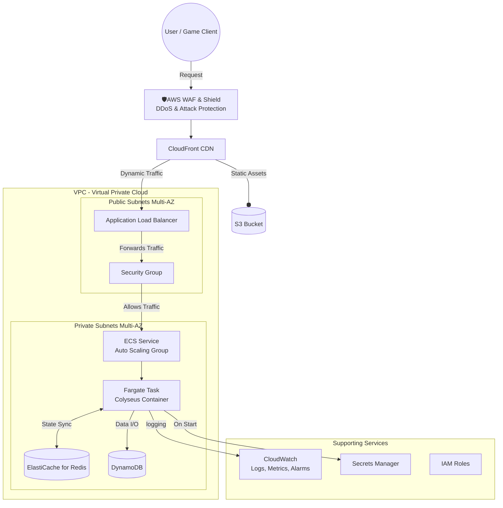

# 🎮 Colyseus on AWS: 本番環境レベルの IaC / CI/CD ポートフォリオ

## 1. プロジェクト概要 (Project Overview)

このプロジェクトは、リアルタイム多人数参加型ゲームサーバーである **[Colyseus](https://www.colyseus.io/)** を、  
**AWS クラウド上で本番環境レベルの品質で稼働** させることを目的とした個人ポートフォリオです。

**Infrastructure as Code (Terraform)** と **CI/CD (GitHub Actions)** のプラクティスを全面的に採用し、  
高可用性、スケーラビリティ、セキュリティ、そしてコスト効率に優れた、  
**再現可能かつ自動化されたクラウドネイティブなシステム** を構築するプロセスを実証します。

---

## 2. 目標アーキテクチャ (Target Architecture)

以下は本プロジェクトが最終的に目指すシステムの全体構成図です。  
ユーザーリクエストの入口からデータストレージまで、多層防御と Multi-AZ による高可用性を考慮した設計です。

## 3. 技術スタック (Technology Stack)

| カテゴリ | 技術 | 目的 |
|----------|------|------|
| クラウド | **AWS (Amazon Web Services)** | 主要なクラウドプラットフォーム |
| コンテナ | **Docker**, **Amazon ECR** | アプリケーションのパッケージ化とレジストリ |
| オーケストレーション | **Amazon ECS on AWS Fargate** | サーバーレスなコンテナ実行環境 |
| IaC | **Terraform** | インフラのコードによる宣言的な管理 |
| CI/CD | **GitHub Actions** | ビルド、テスト、デプロイの自動化 |
| ネットワーク | **VPC**, **ALB**, **CloudFront**, **WAF** | 高可用なトラフィック管理とセキュリティ |
| データストア | **ElastiCache (Redis)**, **DynamoDB** | 状態同期と永続的データストレージ |
| 監視 | **Amazon CloudWatch** | ログ、メトリクス、アラーム |
| セキュリティ | **IAM**, **Secrets Manager** | 権限管理と機密情報管理 |
| アプリケーション | **Colyseus (Node.js, TypeScript)** | リアルタイム通信サーバー |

---

## 4. プロジェクトロードマップ (Project Roadmap)

本プロジェクトは、以下の 4 つのフェーズで段階的に構築を進めています。

###  フェーズ1：ローカルでの実行と手動デプロイ
- [x] Colyseusアプリケーションのコンテナ化 (Docker)  
- [x] Dockerイメージのビルドと ECR へのプッシュ  
- [x] AWS コンソール上での手動デプロイ検証  

**目的:**  
アプリケーションの動作確認と、クラウド上でコンテナを動かすための基本的な要素を理解する。

---

###  フェーズ2：Terraform によるインフラのコード化 (IaC)
- [ ] VPC、サブネット、ルートテーブル等のネットワーク基盤のコード化  
- [ ] ECS クラスター、タスク定義、サービスのコード化  
- [ ] `terraform apply` によるインフラの自動構築  

**目的:**  
手動操作を排除し、再現可能で一貫性のあるインフラをコードで管理する。

---

###  フェーズ3：データ層とネットワーク層の統合
- [ ] ElastiCache (Redis) と DynamoDB の追加  
- [ ] Application Load Balancer (ALB) の導入  
- [ ] セキュリティグループによる精密なアクセスコントロール  

**目的:**  
状態管理と永続化データ層を統合し、安全な公開エンドポイントを持つ本格的なバックエンドを構築する。

---

###  フェーズ4：CI/CD パイプラインの構築と最終化
- [ ] GitHub Actions ワークフローの作成  
- [ ] OIDC による AWS 認証のセキュアな設定  
- [ ] `git push` をトリガーとした、ビルドからデプロイまでの完全自動化  

**目的:**  
開発から本番リリースまでのプロセスを自動化し、迅速なイテレーションを可能にする。

---

## 5. 現在の進捗 (Current Progress)

**フェーズ1は完了済み**です。

- Colyseus アプリケーションを **Docker コンテナ** として正常にパッケージ化済み。  
- ビルドされたイメージは **プライベートな Amazon ECR リポジトリ** に安全に保管済み。  
- これにより、実行環境の標準化が完了し、クラウド上のどこでも同じように動作させる準備が整いました。

**現在の作業:** フェーズ2（Terraform によるインフラのコード化）に着手中。  
- 優先タスク例: ネットワーク（VPC / サブネット）と ECS クラスタの Terraform モジュール化、状態管理（remote state）の設計、Terraform のベストプラクティス導入。

**次のステップ（短期）:**  
1. Terraform モジュールの初期セット（VPC、サブネット、セキュリティグループ）を作成する。  
2. ECS / Fargate 用のタスク定義とサービスを Terraform で定義し、ECR との連携を検証する。  
3. CloudWatch ログや Secrets Manager の基本連携を組み込む。

---
